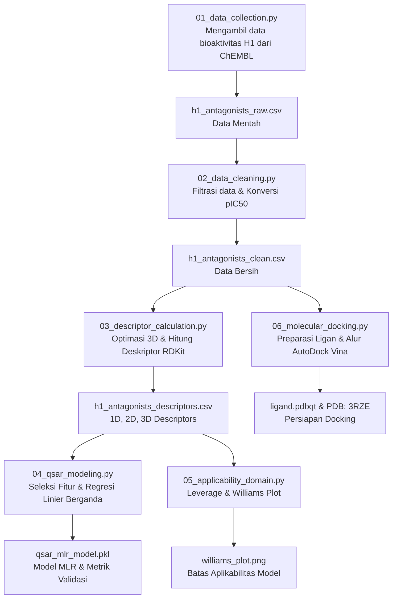

# Log Pengerjaan: Studi QSAR & Pemodelan Molekuler (Histamine H1-Receptor Antagonists)

Log ini mendokumentasikan seluruh tahapan penelitian *Quantitative Structure-Activity Relationship* (QSAR) dan Pemodelan Molekuler (*Molecular Docking*) untuk senyawa antagonis reseptor Histamin H1 yang telah diimplementasikan dalam bentuk skrip Python otomatis di dalam folder kerja Anda.

---

## 📊 Ringkasan Alur Kerja (Workflow)

---

## 🛠️ Rincian Tahapan & Hasil Eksekusi

### 1. Pengumpulan Data (*Data Collection*)
*   **File Skrip:** `01_data_collection.py`
*   **Aksi:** Mengakses ChEMBL REST API untuk mengambil data bioaktivitas senyawa antagonis reseptor Histamin H1 (Target ID: `CHEMBL231`) khusus untuk tipe pengujian $IC_{50}$.
*   **Output:** `h1_antagonists_raw.csv` (Data mentah bioaktivitas).

### 2. Pembersihan Data (*Data Cleaning*)
*   **File Skrip:** `02_data_cleaning.py`
*   **Aksi:**
    *   Memfilter data dengan menyisakan baris yang memiliki nilai $IC_{50}$ dan struktur SMILES yang utuh.
    *   Menstandarkan satuan ke unit nanomolar (nM).
    *   Mengonversi nilai $IC_{50}$ ke bentuk logaritmik negatif ($pIC_{50}$) menggunakan rumus: 
        $$pIC_{50} = 9 - \log_{10}(IC_{50}\text{ dalam nM})$$
    *   Menghilangkan senyawa duplikat berdasarkan SMILES dengan mengambil nilai rata-rata (*mean*) $pIC_{50}$.
*   **Output:** `h1_antagonists_clean.csv` (Senyawa unik bersih dengan nilai $pIC_{50}$).

### 3. Pemodelan Molekuler Ligan & Perhitungan Deskriptor (*Molecular Modeling & Descriptor Calculation*)
*   **File Skrip:** `03_descriptor_calculation.py`
*   **Aksi:**
    *   Membaca data SMILES dan menghasilkan koordinat 3D untuk masing-masing molekul dengan menambahkan atom hidrogen (`AddHs`) dan menggunakan algoritma `EmbedMolecule` (seed=42).
    *   **Optimasi Geometri:** Melakukan minimisasi energi menggunakan *force field* **MMFF94** (`MMFFOptimizeMolecule` sebanyak 200 iterasi) untuk mendapatkan konformasi struktur 3D dengan energi terendah.
    *   Menghitung 208 deskriptor molekuler 2D dan 3D menggunakan modul RDKit (`MoleculeDescriptorCalculator`).
*   **Output:** `h1_antagonists_descriptors.csv` (Dataset deskriptor lengkap).

### 4. Pengembangan Model QSAR (*QSAR Model Development*)
*   **File Skrip:** `04_qsar_modeling.py`
*   **Aksi:**
    *   **Seleksi Fitur Tahap 1:** Membuang deskriptor dengan variansi rendah (threshold < 0.01) sehingga tersisa **175 deskriptor**.
    *   **Seleksi Fitur Tahap 2:** Mengurangi multikolinearitas dengan membuang salah satu dari pasangan deskriptor yang memiliki korelasi silang sangat tinggi ($r > 0.85$), menghasilkan **115 deskriptor**.
    *   **Pembagian Data:** Membagi dataset menjadi *Training Set* (80% / 324 sampel) dan *Test Set* (20% / 81 sampel).
    *   **Skala Data:** Melakukan standarisasi data dengan *Z-score normalization* (StandardScaler).
    *   **Seleksi Fitur Tahap 3 (RFE):** Menggunakan metode *Recursive Feature Elimination* (RFE) berbasis regresi linier untuk memilih **5 deskriptor terbaik** guna menghindari *overfitting* pada model *Multiple Linear Regression* (MLR).
*   **Metrik Validasi Model:**
    *   **$R^2$ Training:** `0.286` (Kemampuan deskriptor terpilih menjelaskan 28.6% variasi aktivitas pada training set)
    *   **RMSE Training:** `1.036` log unit
    *   **$Q^2$ (5-Fold Cross Validation):** `0.257` (Validasi internal menunjukkan model cukup stabil)
    *   **$R^2$ Test (Eksternal):** `0.346` (Kemampuan prediksi eksternal model terhadap test set)
    *   **RMSE Test:** `0.920` log unit
*   **5 Deskriptor Terpilih:**
    1.  `BCUT2D_CHGHI`: Nilai muatan parsial Gasteiger tertinggi pada matriks konektivitas BCUT (menggambarkan polaritas ekstrim molekul).
    2.  `BCUT2D_CHGLO`: Nilai muatan parsial Gasteiger terendah pada matriks konektivitas BCUT.
    3.  `VSA_EState9`: Deskriptor efek medan elektrotopologis berbasis luas permukaan van der Waals.
    4.  `fr_Ndealkylation2`: Jumlah gugus amina tersier alifatis yang dapat mengalami N-dealkilasi (berperan dalam metabolisme obat).
    5.  `fr_bicyclic`: Jumlah cincin bisiklik dalam struktur molekul.
*   **Persamaan QSAR MLR (Terstandarisasi):**
    $$\text{pIC}_{50} = 6.575 - 0.496 \cdot [\text{BCUT2D\_CHGHI}] - 0.332 \cdot [\text{BCUT2D\_CHGLO}] + 0.313 \cdot [\text{VSA\_EState9}] + 0.501 \cdot [\text{fr\_Ndealkylation2}] + 0.495 \cdot [\text{fr\_bicyclic}]$$
*   **Output File:** 
    *   `qsar_mlr_model.pkl` (Model MLR tersimpan)
    *   `qsar_scaler.pkl` (Scaler data tersimpan)
    *   `qsar_selected_features.pkl` (Daftar fitur terpilih)

### 5. Domain Aplikabilitas (*Applicability Domain*)
*   **File Skrip:** `05_applicability_domain.py`
*   **Aksi:** 
    *   Mengevaluasi jangkauan struktural model menggunakan pendekatan matriks leverage (Hat Matrix).
    *   Menghitung nilai *warning leverage limit* ($h^*$) dengan rumus:
        $$h^* = \frac{3(k + 1)}{n} = 0.044$$
        *(di mana $k = 5$ deskriptor dan $n = 405$ senyawa)*.
    *   Residual standar dihitung dan diplot terhadap nilai leverage senyawa untuk membentuk *Williams Plot*.
*   **Output:** `williams_plot.png` (Plot visual batas AD). Senyawa dengan $h > h^*$ atau residu $> \pm3$ dikategorikan sebagai *structural outliers* atau *response outliers*.

### 6. Studi Molecular Docking (*Molecular Docking Prep*)
*   **File Skrip:** `06_molecular_docking.py`
*   **Aksi:**
    *   **Preparasi Ligan:** Memilih senyawa teraktif dari dataset (nilai $pIC_{50}$ tertinggi), meminimalkan energi konformasinya dengan MMFF94, dan mengonversinya ke format `ligand.pdbqt` menggunakan library Python `meeko`.
    *   **Reseptor:** Secara otomatis mengunduh struktur 3D reseptor Histamin H1 (`3RZE.pdb`) dari Protein Data Bank (RCSB PDB).
    *   **Integrasi AutoDock Vina:** Menyediakan alur pemanggilan file eksekusi `vina.exe` via subprocess untuk melakukan simulasi docking menggunakan parameter grid box terarah.

---

## 📈 Langkah Selanjutnya yang Direkomendasikan

> [!TIP]
> 1. **Preparasi Reseptor Manual:** 
>    Gunakan program **AutoDockTools (ADT)** atau **Discovery Studio** untuk membuang ligan Doxepin bawaan, membuang molekul air bebas, menambahkan atom hidrogen polar, dan menambahkan muatan parsial Kollman pada file `3rze.pdb`, kemudian simpan sebagai `receptor.pdbqt` di folder proyek ini.
> 2. **Menjalankan Vina:**
>    Pastikan file `vina.exe` berada di folder yang sama dengan skrip `06_molecular_docking.py`. Setelah `receptor.pdbqt` dan `vina.exe` siap, jalankan kembali skrip `06_molecular_docking.py` untuk memulai docking otomatis.
> 3. **Analisis Interaksi Visual:**
>    Buka file `docking_result.pdbqt` bersama `receptor.pdbqt` di program visualisasi seperti **PyMOL** atau **Biovia Discovery Studio** untuk mengamati interaksi ikatan hidrogen, *pi-pi stacking*, atau interaksi hidrofobik dengan asam amino kunci seperti **Asp107** dan **Trp428**.
